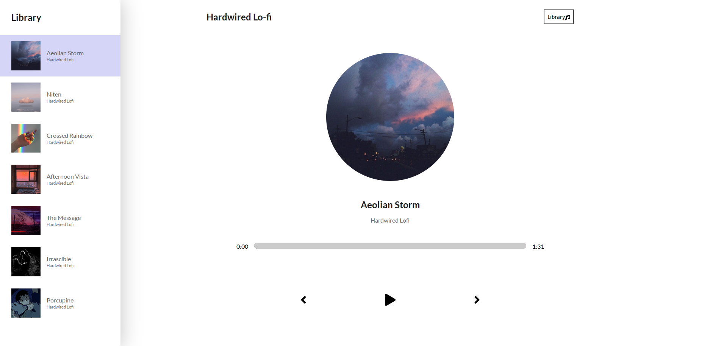

# Music App With React

## Objective

The aim of this project was twofold. 

The first was to learn how to develop a pratical consumer grade application with ReactJS. 

The second was to provide myself with a website to host the songs I make in my free time. 

## Technologies

- ReactJS
- Syntatically Awesome Style Sheets (SASS)
- Netlify

## Test it yourself

The application is hosted [here](https://hardwired-lofi.netlify.app/)

## Screenshot

